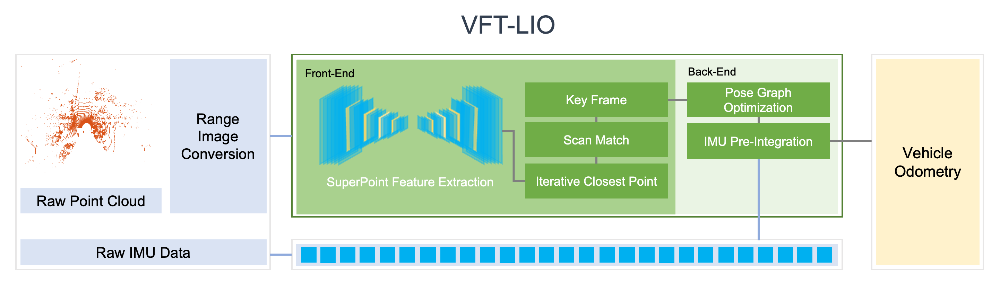

# VFT-LIO: Visual Feature Tracking for robust LiDAR Inertial Odometry Under Repetitive Patterns

This repository contains the implementation of **VFT-LIO**, a front-end SLAM module that enhances odometry estimation in repetitive environments such as tunnels and bridges. The method leverages **SuperPoint**, a deep learning-based visual feature extraction method, on LiDAR intensity images and refines pose estimation using ICP.

## 🔧 Features
- Visual feature extraction from LiDAR intensity images
- Conversion of extracted visual feature to corresponding point cloud
- Feature-based ICP pose refinement
- ROS-compatible implementation

## 🧩 System Pipeline
The figure below illustrates the full pipeline of VFT-LIO, including feature extraction, point cloud association, and ICP-based refinement.

<p align="center">
  
</p>

## 📸 Example Results

We provide example results using our proposed VFT-LIO method in repetitive environments such as tunnels and bridges.
As shown below, the system demonstrates robust odometry estimation even in highly repetitive environments, such as tunnels and bridges.

<p align="center">
  
  
</p>

<p align="center">
  
  
</p>

## 📦 Installation

```
cd ~/catkin_ws/src
git clone https://github.com/yourname/VFT-LIO.git
cd ..
catkin_make
source devel/setup.bash
```

## 🚀 How to Use

Pre-trained SuperPoint weights are provided at  
`pretrained/superPointNet_checkpoint.pth.tar`

To run the system with the pre-trained weights, simply execute the following commands:

```bash
roslaunch liosam run.launch
rosrun lio_sam visual_tracking.py
rosbag play bridge_0202.bag

💡 **Note:** A sample dataset recorded in a repetitive environment (e.g., tunnel or bridge)  
will be provided soon for demonstration and testing purposes.
```

## 🔍 Modification Notice

This repository is a modified version of [LIO-SAM](https://github.com/TixiaoShan/LIO-SAM),  
with a visual frontend added for robust odometry in repetitive environments.  
SuperPoint was integrated for feature extraction from LiDAR intensity images.

Modifications by **Donghyun Choi** (choi23@kaist.ac.kr)

## 📚 Citations

If you use this code, please cite the following works:

### 🔹 LIO-SAM

```bibtex
@inproceedings{liosam2020shan,
  title={LIO-SAM: Tightly-coupled Lidar Inertial Odometry via Smoothing and Mapping},
  author={Shan, Tixiao and Englot, Brendan and Meyers, Drew and Wang, Wei and Ratti, Carlo and Rus, Daniela},
  booktitle={IEEE/RSJ International Conference on Intelligent Robots and Systems (IROS)},
  year={2020},
  organization={IEEE}
}
```

### 🔹 SuperPoint
```bibtex
@inproceedings{detone2018superpoint,
  title={SuperPoint: Self-Supervised Interest Point Detection and Description},
  author={DeTone, Daniel and Malisiewicz, Tomasz and Rabinovich, Andrew},
  booktitle={CVPR Workshops},
  year={2018}
}
```